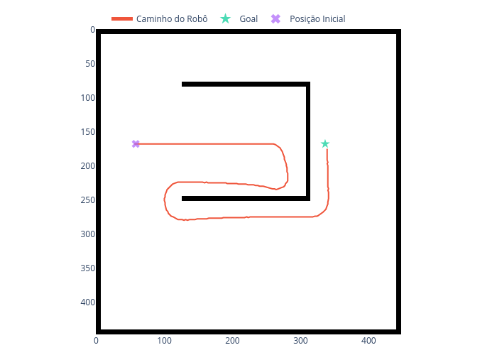
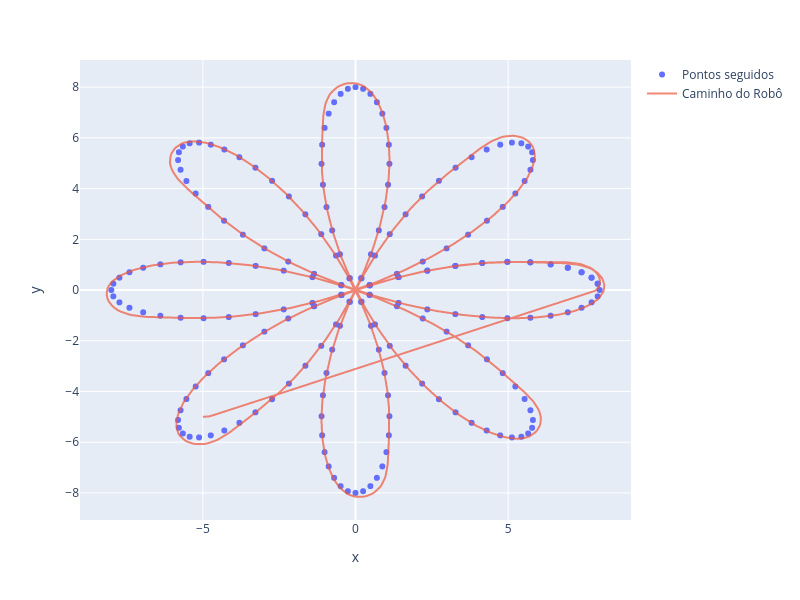
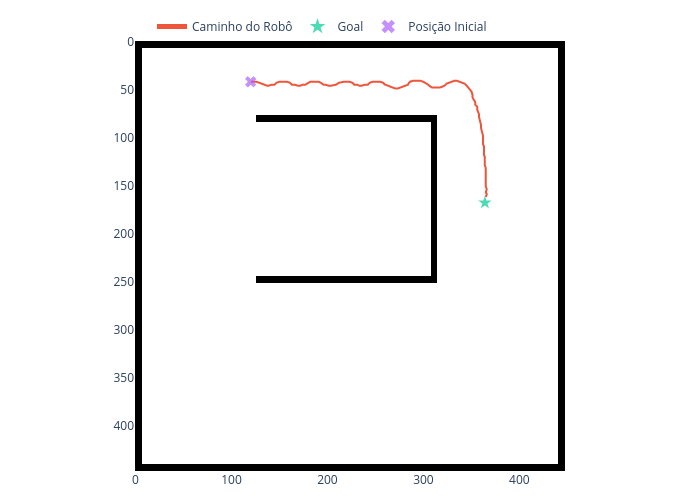
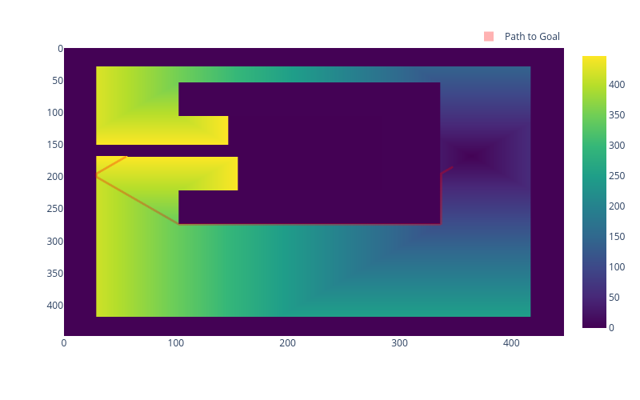
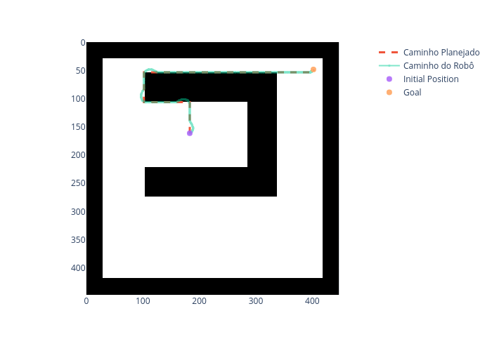
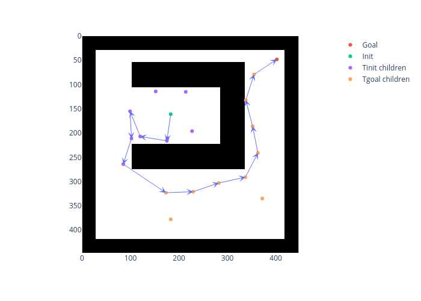
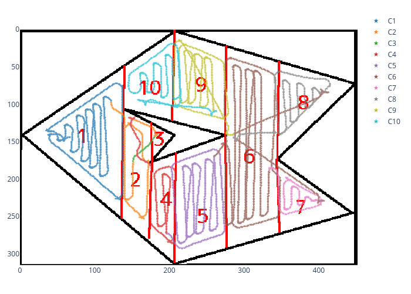
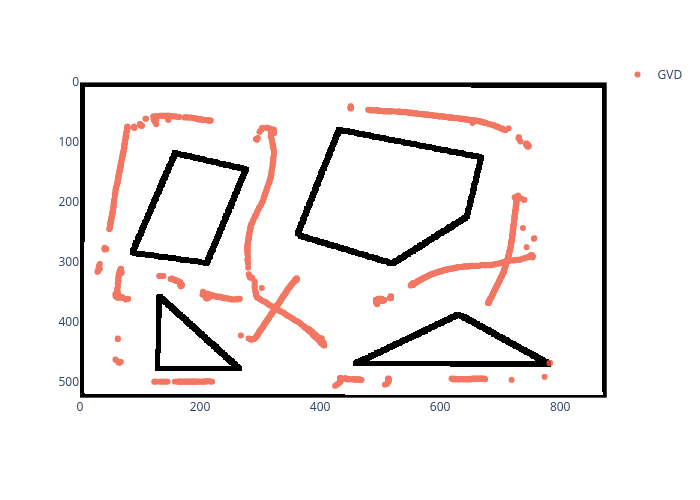

# EEE935 - Tópicos Especiais em Sinais e Sistemas: Planejamento de Movimento de Robôs

## Contents

- [Overview](#overview)
  - [Examples](#examples)
- [Usage](#usage)
  - [Tangent Bug](#tangent-bug)
  - [Path Following](#path-following)
  - [Potential Function](#potential-function)
  - [Wave-Front](#wave-front)
  - [A*](#a)
  - [GVD (incomplete)](#gvd)
  - [Coverage](#coverage)
  - [RRT](#rrt)
- [References](#references)

## Overview

This repository is just a compilation of each assignment from the 2021/2 EEE935 class. It includes the following motion planning algorithms using ROS + Python: [Tangent Bug](./catkin_ws/src/tangent_bug/), a [Path Following](./catkin_ws/src/path_following/), a simple [Potential Function](./catkin_ws/src/potential_function/), [Wave-Front](./catkin_ws/src/wavefront/), [A*](./catkin_ws/src/Astar/), a sensor-based [GVD](./catkin_ws/src/GVD/), a [coverage](./catkin_ws/src/coverage/) algorithm and a [RRT](./catkin_ws/src/RRT/) planner. For each one of these, the robot is non-holonomic and a velocity controller is used with feedback linearization. Stage simulator is used for every algorithm. Every algorithm was implemented as given in *Choset, Lynch, and Hutchinson*[^1].

The description of the assignments are in the [TPs](./TPs) folder.

The path following algorithm works by following a list of time-independent coordinates. The Potential Function algorithm uses simple repulsive and attractive potentials. The Wave Front algorithm accepts 4 and 8 point connectivity. The A* generates the graph in real-time based on a premade grid. The **incomplete** GVD algorithm generates a Generalized Voronoi Diagram (GVD) based on sensor readings. The Coverage algorithm depends on a premade trapezoidal cell decomposition and, based on a list of cells (`Cell` class as defined in its script), covers the whole map. The RRT algorithm uses a bidirectional RRT based on a grid. Every grid used has the obstacles expanded in order to treat the robot as a point.

### Examples

|| 
|:--:|:--:|
|Tangent Bug| Path(different rotation bias) |

|| 
|:--:|:--:|
|Path Following| Path |

|| 
|:--:|:--:|
|Potential Function| Path (2nd) |

|| 
|:--:|:--:|
|Wave Front| Wavefront Grid (8 neighbors) |

|| 
|:--:|:--:|
| A* | Path |

|| 
|:--:|:--:|
| RRT | Path + Trees|

|| 
|:--:|:--:|
| Coverage | Path + Cell decomposition|

|| 
|:--:|:--:|
| GVD | Resulting GVD|

## Usage

The python scripts for Tangent Bug, Potential Function, Wave-Front, A* and RRT algorithms assume the existence of two robots in Stage simulator/.world file, the first, green square, robot being the robot to be controlled and the second, orange square, a representation of the goal. So if any other map is used and it does not have two objects in this specific order, then the rospy Publishers and Subscribers for each one of these python scripts should be changed.

Path Following, Wave-Front, A*, Coverage and RRT behavior will not change if only the map is changed as they have internal parameters in respect to the default map.

### Tangent Bug

By default it is assumed that the map is [empty.world](./catkin_ws/src/tangent_bug/worlds/maze.world). If any other map is used, the user must edit its launch file, if you are not going to run it manually.

Running with the default map and parameters implies that the goal, the orange square, is set to (4, 2) and the initial robot position is set to (-6, 2). When this goal is reached, it's possible to move the robot with the mouse and rerun the algorithm, such that the robot can converge to the *same* goal from a different initial position.

The algorithm should recognize that it is impossible to reach the goal in some scenarios. For testing this behavior `goal:="0 -11"` is a recommended parameter. The are cases where the algorithm doesn't behave properly, so this goal position and robot's default initial position guarantee that it will work prperly.

#### Launch File

It's possible to run the [Tangent Bug](./catkin_ws/src/tangent_bug/) algorithm using its [launch file](./catkin_ws/src/tangent_bug/launch/tangent_bug.launch). There is a optional argument `goal` that corresponds to the coordinates of the goal in meters as `"x_goal y_goal"`, by default `goal:="4 2"`.

To run *with default parameters*, simply run in terminal:

```zsh
roslaunch potential_function potential_function.launch
```

To run with *different parameters*:

```zsh
roslaunch potential_function potential_function.launch goal:="0 -10"
```

#### Running Manually

In one terminal run:

```zsh
roscd tangent_bug
rosrun stage_ros stageros worlds/maze.world 
```

In another terminal run:

```zsh
rosrun tangent_bug tangent_bug_alg.py x y
```

where `x` is the goal x-coordinate, `y` is the goal y-coordinate.

### Path Following

By default it is assumed that the map is [empty.world](./catkin_ws/src/path_following/worlds/empty.world). If any other map is used, the user must edit its launch file, if you are not going to run it manually.

The default map implies that the path to be followed is a Rhodonea curve given with 6 petals.

#### Launch File

It's possible to run the [Path Following](./catkin_ws/src/path_following/) algorithm using its [launch file](./catkin_ws/src/path_following/launch/path_following.launch).

Simply run in terminal:

```zsh
roslaunch path_following path_following.launch
```

#### Running Manually

In one terminal run:

```zsh
roscd path_following
rosrun stage_ros stageros worlds/empty.world 
```

In another terminal run:

```zsh
rosrun path_following path_following.py
```

### Potential Function

By default it is assumed that the map is [maze.world](./catkin_ws/src/potential_function/worlds/maze.world). If any other map is used, the user must edit its launch file, if you are not going to run it manually.

Running with the default map and parameters implies that the goal, the orange square, is set to (5, 2) and the initial robot position is set to (-2, -4). When this goal is reached, it's possible to move the robot with the mouse and rerun the algorithm, such that the robot can converge to the *same* goal from a different initial position.

#### Launch File

It's possible to run the [Potential Function](./catkin_ws/src/potential_function/) algorithm using its [launch file](./catkin_ws/src/potential_function/launch/potential_function.launch). There is a optional argument `goal` that corresponds to the coordinates of the goal in meters as `"x_goal y_goal"`, by default `goal:="5 2"`.

To run *with default parameters*, simply run in terminal:

```zsh
roslaunch potential_function potential_function.launch
```

To run with *different parameters*:

```zsh
roslaunch potential_function potential_function.launch goal:="-6 -2"
```

#### Running Manually

In one terminal run:

```zsh
roscd potential_function
rosrun stage_ros stageros worlds/maze.world 
```

In another terminal run:

```zsh
rosrun potential_function potential_function.py x y
```

where `x` is the goal x-coordinate, `y` is the goal y-coordinate.

### Wave-Front

The [Wave-Front](./catkin_ws/src/wavefront/) algorithm depends on a pre-made grid that corresponds to the configuration space of a map. This grid is a binary matrix, where 0s correspond to free space and 1s correspond to obstacles. It then computes the planner grid as in *Choset, Lynch, and Hutchinson*[^1], using 4 or 8 point connectivity. Robot motion is then based on the generated planner grid.

By default it is assumed that the map is [maze.world](./catkin_ws/src/wavefront/worlds/maze.world) and its respective configuration space grid [grid1.npy](./catkin_ws/src/wavefront/worlds/grid1.npy). If any other map is used, the user must edit [wavefront.py](./catkin_ws/src/wavefront/scripts/wavefront.py) with the respective Stage parameters and configuration space grid (.npy file). If the launch file is used, the user should change its .world file.

To create configuration space grids for other maps, you can use the [map_expander.py](./catkin_ws/src/wavefront/scripts/map_expander.py) script changing the parameters as necessary.

The robot's initial position **must** be set on `wavefront.py`. When this algorithm is run with the default map the *green* square represents the robot and the *orange* square represents the goal at the default position, i.e. (5, 2).

#### Launch File

It's possible to run the [Wave-Front](./catkin_ws/src/wavefront/) planner using its [launch file](./catkin_ws/src/wavefront/launch/wavefront.launch). There are two optional arguments `goal` and `neighbors`. `goal` are the coordinates of the goal in meters as `"x_goal y_goal"`, and `neighbors` is the number of connectivity points to use when creating the Wave-Front grid, its value can be either **4** or **8** (if any other integer is passed, 8 is assumed).

The default arguments are `goal:="5 2"` and `neighbors:="4"`.

To run *with default parameters*, simply run in terminal:

```zsh
roslaunch wavefront wavefront.launch
```

To run with *different parameters*:

```zsh
roslaunch wavefront wavefront.launch goal:="-6 -2" neighbors:="8"
```

#### Running Manually

In one terminal run:

```zsh
roscd wavefront
rosrun stage_ros stageros worlds/maze.world 
```

In another terminal run:

```zsh
rosrun wavefront wavefront.py x y n 
```

where `x` is the goal x-coordinate, `y` is the goal y-coordinate, and `n` is the number of neighbors.

### A*

The [A*](./catkin_ws/src/Astar/) algorithm depends on a pre-made grid that corresponds to the configuration space of a map. This grid is a binary matrix, where 0s correspond to free space and 1s correspond to obstacles. It then computes the $A^*$ graph as in *Choset, Lynch, and Hutchinson*[^1], using 4 point connectivity.

By default it is assumed that the map is [maze.world](./catkin_ws/src/Astar/worlds/maze.world) and its respective configuration space grid [grid1.npy](./catkin_ws/src/Astar/worlds/grid1.npy). If any other map is used, the user must edit [Astar.py](./catkin_ws/src/Astar/scripts/Astar.py) with the respective Stage parameters and configuration space grid (.npy file). If the launch file is used, the user should change its .world file.

To create configuration space grids for other maps, you can use the [map_expander.py](./catkin_ws/src/wavefront/scripts/map_expander.py) script changing the parameters as necessary and transposing the resulting map.

The robot's initial position **must** be set on `Astar.py`. When this algorithm is run with the default map the *green* square represents the robot and the *orange* square represents the goal at the default position, i.e. (5, 2).

#### Launch File

It's possible to run the [A*](./catkin_ws/src/Astar/) planner using its [launch file](./catkin_ws/src/Astar/launch/Astar.launch). There is one optional argument `goal`, the coordinates of the goal in meters as `"x_goal y_goal"`. The default is `goal:="5 2"`.

To run *with default parameters*, simply run in terminal:

```zsh
roslaunch Astar Astar.launch
```

To run with *different parameters*:

```zsh
roslaunch Astar Astar.launch goal:="-6 -2"
```

#### Running Manually

In one terminal run:

```zsh
roscd Astar
rosrun stage_ros stageros worlds/maze.world 
```

In another terminal run:

```zsh
rosrun Astar Astar.py x y 4
```

where `x` is the goal x-coordinate and `y` is the goal y-coordinate.

### GVD

The [GVD](./catkin_ws/src/GVD/) algorithm is incomplete. It should create a Generalized Voronoi Diagram based on sensors readings.

By default it is assumed that the map is [gvd.world](./catkin_ws/src/GVD/worlds/gvd.world). If the launch file is used, the user should change its .world file in order to use a different map.

#### Launch File

It's possible to run the [GVD](./catkin_ws/src/GVD/) using its [launch file](./catkin_ws/src/GVD/launch/GVD.launch).

Run in terminal:

```zsh
roslaunch GVD GVD.launch
```

#### Running Manually

In one terminal run:

```zsh
roscd GVD
rosrun stage_ros stageros worlds/gvd.world 
```

In another terminal run:

```zsh
rosrun GVD GVD.py
```

### Coverage

The [Coverage](./catkin_ws/src/coverage/) algorithm depends on a [pre-made list](./catkin_ws/src/coverage/worlds/trapz_dec2.pickle) that contains every `Cell` of the handmade Trapezoidal decomposition.

By default it is assumed that the map is [trapz2.world](./catkin_ws/src/coverage/worlds/trapz2.world). If the launch file is used, the user should change its .world file in order to use a different map and change the [list file](./catkin_ws/src/coverage/worlds/trapz_dec2.pickle). The user should also change the `.pickle` path in [coverage.py](./catkin_ws/src/coverage/scripts/coverage.py)

#### Launch File

It's possible to run the [Coverage](./catkin_ws/src/coverage/) algorithm using its [launch file](./catkin_ws/src/coverage/launch/coverage.launch).

Run in terminal:

```zsh
roslaunch coverage coverage.launch
```

#### Running Manually

In one terminal run:

```zsh
roscd coverage
rosrun stage_ros stageros worlds/trapz2.world  
```

In another terminal run:

```zsh
rosrun coverage coverage.py
```

### RRT

The [RRT](./catkin_ws/src/RRT/) algorithm depends on a pre-made grid that corresponds to the configuration space of a map. This grid is a binary matrix, where 0s correspond to free space and 1s correspond to obstacles. It then computes the bidirectional RRT as in *Choset, Lynch, and Hutchinson*[^1].

By default it is assumed that the map is [maze.world](./catkin_ws/src/RRT/worlds/maze.world) and its respective configuration space grid [grid1.npy](./catkin_ws/src/RRT/worlds/grid1.npy). If any other map is used, the user must edit [RRT.py](./catkin_ws/src/RRT/scripts/RRT.py) with the respective Stage parameters and configuration space grid (.npy file). If the launch file is used, the user should change its .world file.

To create configuration space grids for other maps, you can use the [map_expander.py](./catkin_ws/src/wavefront/scripts/map_expander.py) script changing the parameters as necessary and transposing the resulting map.

The robot's initial position **must** be set on `RRT.py`. When this algorithm is run with the default map the *green* square represents the robot and the *orange* square represents the goal at the default position, i.e. (5, 2).

#### Launch File

It's possible to run the [RRT](./catkin_ws/src/RRT/) using its [launch file](./catkin_ws/src/RRT/launch/RRT.launch). There is one optional argument `goal`, the coordinates of the goal in meters as `"x_goal y_goal"`. The default is `goal:="5 2"`.

To run *with default parameters*, simply run in terminal:

```zsh
roslaunch RRT RRT.launch
```

To run with *different parameters*:

```zsh
roslaunch RRT RRT.launch goal:="-6 -2"
```

#### Running Manually

In one terminal run:

```zsh
roscd RRT
rosrun stage_ros stageros worlds/maze.world 
```

In another terminal run:

```zsh
rosrun RRT RRT.py x y
```

where `x` is the goal x-coordinate and `y` is the goal y-coordinate.

## References

[^1]: Howie Choset, K. M. Lynch, and S. Hutchinson, Principles of robot motion: theory, algorithms, and implementations. Cambridge, Mass. Bradford, 2005.
‌
